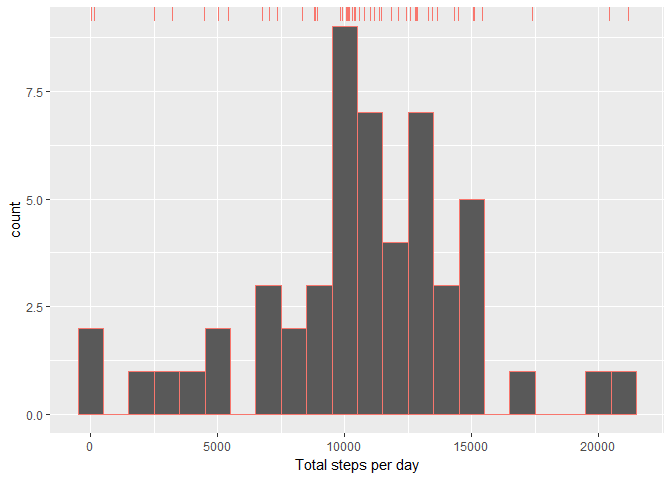
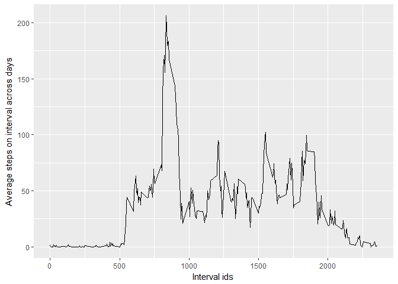
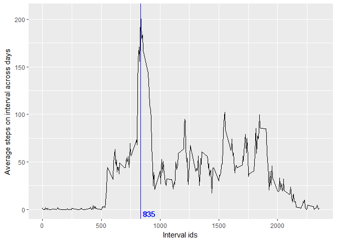
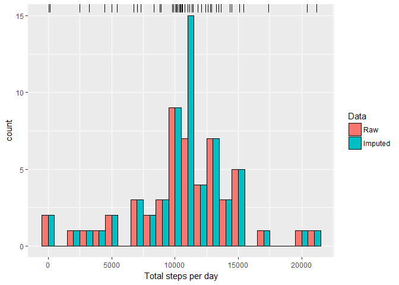
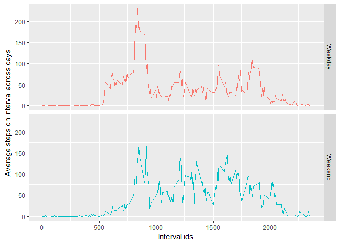

# Reproducible Research: Peer Assessment 1


## Loading and preprocessing the data

Lets extract given data file (`activity.zip`) and load it into the memory. Lets also convert **date** column to `Date` type.

```r
unzip("activity.zip", exdir = ".")
data <- read.csv("activity.csv")
data$date <- as.Date(data$date, format="%Y-%m-%d")
```

Before we start lets make few preparations. We will need to use `dplyr` and `ggplot2` libraries. Lets import them first.

```r
library(dplyr)
library(ggplot2)
```

Also, to simplify process of printing output lets define `printf()` function.

```r
printf <- function(...) invisible(cat(sprintf(...)))
```

With prepared data lets proceed forward to anser following questions.

## What is mean total number of steps taken per day?

At first **let's ignore missing (`NA`) values** to analize total amount of steps. So lets just ignore them and look at the corresponding data. 
We will need to the same calculation a little bit later, so lets define a function.

```r
calculate_steps_per_day <- function(data) {
  data %>%
    filter(!is.na(steps)) %>%
    group_by(date) %>%
    summarise(steps = sum(steps))
}
steps_per_day <- calculate_steps_per_day(data)
dim(steps_per_day)
```

```
## [1] 53  2
```

As we can see, there are total of 53 days with non-empty results. Histogram can help us to see distribution of total steps values per day.
This plot also will be usefull in the future. Thats why we create it via function.

```r
ggplot(steps_per_day, aes(steps, colour = "red")) +
  geom_histogram(binwidth = 1000) +
  xlab("Total steps per day") +
  geom_rug(sides = "t") +
  theme(legend.position = "none")
```

<!-- -->

It shows that a significant amount of data is concentrated in the interval from 10000 to 15000 steps with peak at 10000 steps per day. If we calculate the mean and the median, we can see that that peak is the mean (and the median also) of given data. That answers our question:

```r
mean_steps_per_day <- mean(steps_per_day$steps)
median_steps_per_day <- median(steps_per_day$steps)

printf(
  "Mean of total steps per day: %s\nMedian of total steps per day: %s",
  mean_steps_per_day,
  median_steps_per_day
)
```

```
## Mean of total steps per day: 10766.1886792453
## Median of total steps per day: 10765
```

## What is the average daily activity pattern?

To answer this question we need to prepare our data at first.

```r
avg_steps_per_interval <- data %>%
  filter(!is.na(steps)) %>%
  group_by(interval) %>%
  summarise(avg_steps = mean(steps))
dim(avg_steps_per_interval)
```

```
## [1] 288   2
```

As we can see, there are total of 288 different time intervals. Lets visualize them using time series plot.

```r
ggplot(avg_steps_per_interval, aes(interval, avg_steps)) +
  geom_line(size = 0.5, colour = "black") +
  xlab("Interval ids") +
  ylab("Average steps on interval across days")
```

<!-- -->

Plot demonstarates that maximum average number of steps located in interval with id somethere between 750 and 1000. Lets's find it.

```r
max_steps <- max(avg_steps_per_interval$avg_steps)
inteval_with_max_steps <- avg_steps_per_interval %>%
  filter(avg_steps == max_steps) %>%
  select(interval)

ggplot(avg_steps_per_interval, aes(interval, avg_steps)) +
  geom_line(size = 0.5, colour = "black") +
  geom_vline(xintercept = inteval_with_max_steps[[1]], colour = "blue") +
  geom_text(
    aes(x = inteval_with_max_steps[[1]], label = inteval_with_max_steps[[1]], y = 0),
    colour = "blue",
    vjust = 1.2,
    hjust = -0.2
  ) +
  xlab("Interval ids") +
  ylab("Average steps on interval across days")
```

<!-- -->

That answers the second quesion.

## Imputing missing values

We've been ignoring missing values for some time. To be sure that they didn't affect obtained results we need to analize them.
First of all, lets calculate the total number of missing values.

```r
na_total_number <- (data %>%
                      filter(is.na(steps)) %>%
                      summarise(count = n()))[[1]]
printf("Total missing values number: %s\n", na_total_number)
```

```
## Total missing values number: 2304
```

```r
printf("Missing values per cent: %1.2f%%", na_total_number / dim(data)[1])
```

```
## Missing values per cent: 0.13%
```

13% is not that small amount. Lets fill missing values using simple strategy: with means for corresponding 5-minute interval. We already have average values in `avg_steps_per_interval` variable.

```r
interpolated_data <- data
for(i in 1:nrow(interpolated_data)) {
    row <- interpolated_data[i,]
    if (is.na(row["steps"])) {
        interval_id <- unlist(row["interval"])
        avg <- avg_steps_per_interval %>% filter(interval == interval_id)
        interpolated_data[i, "steps"] <- avg$avg_steps
    }
    
}
```

Lets make the histogram of interploated data and compare it with the original one.

```r
interpolated_steps_per_day <-
  calculate_steps_per_day(interpolated_data)

data_to_plot <- rbind(
  data.frame(steps = steps_per_day$steps, Data = "Raw"),
  data.frame(steps = interpolated_steps_per_day$steps, Data = "Imputed")
)

ggplot(data_to_plot, aes(x = steps, fill = Data)) +
  geom_histogram(binwidth = 1000,
                 colour = "black",
                 position = "dodge") +
  xlab("Total steps per day") +
  geom_rug(sides = "t")
```

<!-- -->

We can see the major difference at this plot: a huge pike around 11000 steps. Lets see how this difference affected mean and median.

```r
mean_interpolated_steps_per_day <-
  mean(interpolated_steps_per_day$steps)
median_interpolated_steps_per_day <-
  median(interpolated_steps_per_day$steps)

printf(
  "Mean of total steps per day (w/o NA): %s\nMedian of total steps per day (w/o NA): %s\n",
  mean_interpolated_steps_per_day,
  median_interpolated_steps_per_day
)
```

```
## Mean of total steps per day (w/o NA): 10766.1886792453
## Median of total steps per day (w/o NA): 10766.1886792453
```

```r
printf(
  "Mean changed: %s\nMedian changed: %s",
  abs(mean_steps_per_day - mean_interpolated_steps_per_day),
  abs(median_steps_per_day - median_interpolated_steps_per_day)
)
```

```
## Mean changed: 0
## Median changed: 1.1886792452824
```

However, mean hasn't been changed at all. Median has been changed only a little bit. 
It means that at average missing values hardly affect results. And **our previous estiimation** (that ignored `NA` values) **was OK**.

As we can see, total daily number of steps hasn't changed. It means that **missing value did not affect estimations**.

## Are there differences in activity patterns between weekdays and weekends?

Lets answer the last question. Is number of steps at weekdays differs from weekends.
To do it we need to add additional column to interpolated data set.

```r
interpolated_data$weekday <- weekdays(interpolated_data$date)
interpolated_data$day_type <- ifelse(
  interpolated_data$weekday == "Saturday" | interpolated_data$weekday == "Sunday",
    "Weekend",
    "Weekday"
)
interpolated_data$day_type <- as.factor(interpolated_data$day_type)
```

With this information we can make a plot to show the difference.
First af all, lets build data frame which holds required information.

```r
day_types_avg_steps_per_interval <- interpolated_data %>%
  filter(!is.na(steps)) %>%
  group_by(day_type, interval) %>%
  summarise(avg_steps = mean(steps))
```

Now we can plot this data.

```r
  qplot(
    interval,
    avg_steps,
    data = day_types_avg_steps_per_interval,
    geom = c("line"),
    facets = day_type ~ .,
    color = day_type
  ) +
  xlab("Interval ids") +
  ylab("Average steps on interval across days") +
  theme(legend.position = "none")
```

<!-- -->

As we can see, there is a difference in activity pattern between weekdays and weekends.
